# AI-Based Smart Study Companion — Product Requirements Document (PRD)

**Version:** 0.1 (Draft)
**Status:** Phase 1 (MVP) scoping
**Owner:** [Your Name]
**Last updated:** 2026-09-11

---

## 1. Problem Statement

Existing AI chatbots used for studying fail learners in four consistent ways:

| Gap in existing chatbots | Consequence |
|---|---|
| No structured content | Student doesn't know what to study next, or how much is left |
| No real "teach me this" interaction | Chatbot answers questions but doesn't *teach* a topic step by step |
| Few/no visualizations | Concepts that need diagrams are explained only in text |
| No voice-based teaching in natural / native language | Slower retention — people learn faster hearing explanations in a language and format they're comfortable with |

**Product thesis:** A study companion that containerizes every subject into a syllabus tree, teaches interactively (text + voice, multilingual), tests adaptively, and shows the student exactly where they're weak — closing the loop between *learning* and *evaluation*.

---

## 2. Goals (Phase 1 / MVP)

1. Let a user create subject containers from an uploaded syllabus (auto-parsed) or manually.
2. Let a user mark topics/sub-topics complete via a checkbox tree.
3. Provide a chatbot, on the same screen as the tree, that teaches a specific topic on request.
4. Provide adaptive assessments (theory ladder for non-coding, code+sandbox+"teach from error" for coding).
5. Show strength/weakness breakdown per subject based on test results.
6. Provide authentication.
7. Provide a multilingual voice assistant (mic in → voice out).
8. Provide a Pomodoro-style focus timer tied to study sessions.

**Non-goals for Phase 1:** activity/streak visualizations (Phase 2), social/multiplayer features, offline mode, native mobile apps.

---

## 3. Primary User Persona

**"Rahul", 20, engineering student**
- Studies 3–4 subjects per semester, some coding (Python, DSA), some theory (DBMS, OS).
- Has PDF syllabus from college but no structured way to track progress.
- Prefers explanations in Hinglish/native language when concepts get hard.
- Currently pastes doubts into a generic chatbot and gets unstructured, one-shot answers with no memory of what he already knows.

---

## 4. Feature List — Phase 1 vs Phase 2

| # | Feature | Phase |
|---|---|---|
| 1 | Subject containerization + syllabus upload + topic tree w/ checkboxes | 1 |
| 2 | Contextual teaching chatbot (text) | 1 |
| 3 | Adaptive subject assessment (theory ladder + coding sandbox + error-teaching) | 1 |
| 4 | Strength/weakness report | 1 |
| 5 | Authentication | 1 |
| 6 | Multilingual voice assistant (STT in, TTS out) | 1 |
| 7 | Pomodoro focus session | 1 |
| 8 | Activity/study-time visualizations & heatmaps | 2 |

---

## 5. System Architecture (High Level)

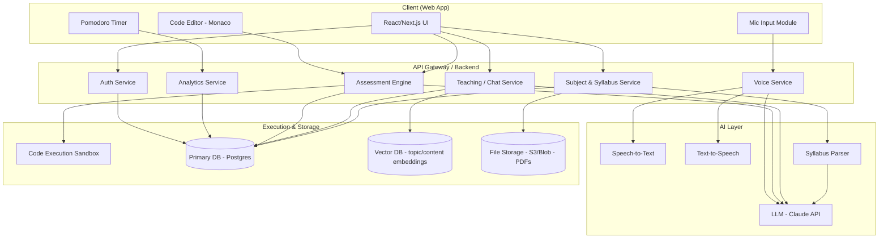

---

## 6. End-to-End Data Flow (Overall)

```mermaid
flowchart LR
    A[User signs up / logs in] --> B[User creates Subject]
    B --> C{Upload syllabus?}
    C -->|Yes| D[PDF sent to backend]
    D --> E[Text extraction + LLM parses topics/sub-topics]
    E --> F[Hierarchical tree generated]
    C -->|No| G[User manually adds topics/sub-topics]
    F --> H[Tree shown with checkboxes]
    G --> H
    H --> I[User studies a topic]
    I --> J[Chatbot teaches - text/voice]
    J --> K[User marks topic complete]
    K --> L[Completed topics feed Assessment pool]
    L --> M[User starts Assessment on a topic]
    M --> N[Adaptive question engine]
    N --> O[User answers]
    O --> P{Correct?}
    P -->|Yes| Q[Difficulty increases]
    P -->|No| R[Difficulty decreases / explain error]
    Q --> S[Results stored]
    R --> S
    S --> T[Strength/Weakness report generated]
    T --> H
```

---

## 7. Feature-Level Flows

### 7.1 Subject Creation & Syllabus Parsing

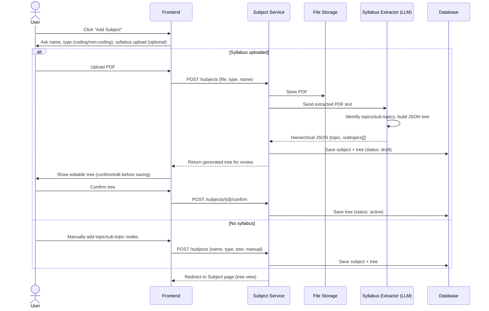

**Notes / edge cases**
- Extraction must degrade gracefully: scanned/image PDFs → OCR fallback → if still low confidence, fall back to "manual entry" with a message.
- Tree is always user-editable post-generation (add/rename/delete nodes) — auto-extraction is a starting point, not final.

---

### 7.2 Topic Tree + Teaching Chatbot

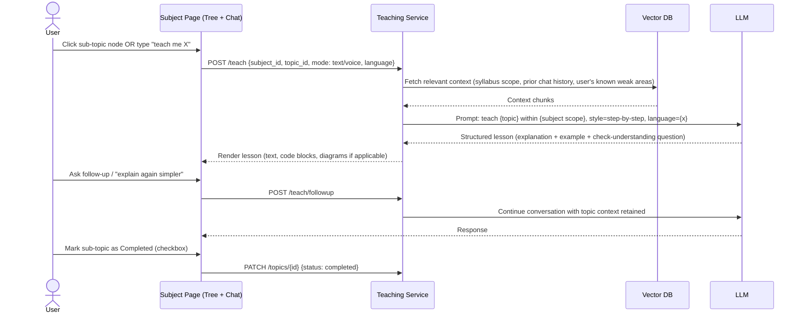

**Key design decision:** the chat is topic-scoped, not a generic open chat — every message carries `subject_id` + `topic_id` context so the LLM stays within syllabus boundaries and prior lesson history.

---

### 7.3 Adaptive Assessment — Non-Coding Subject

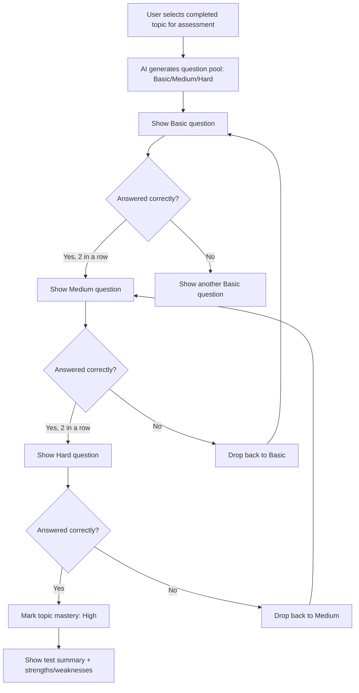

**Adaptive rule set (to finalize):**
- Level-up threshold: 2 consecutive correct at current level.
- Level-down threshold: 2 consecutive incorrect at current level.
- Each topic gets a rolling `mastery_score` (0–100) updated after every question, not just at test end.
- Test ends after N questions (configurable, default 10) or when mastery confidence is high/low enough to stop early.

---

### 7.4 Adaptive Assessment — Coding Subject (with "teach from error")

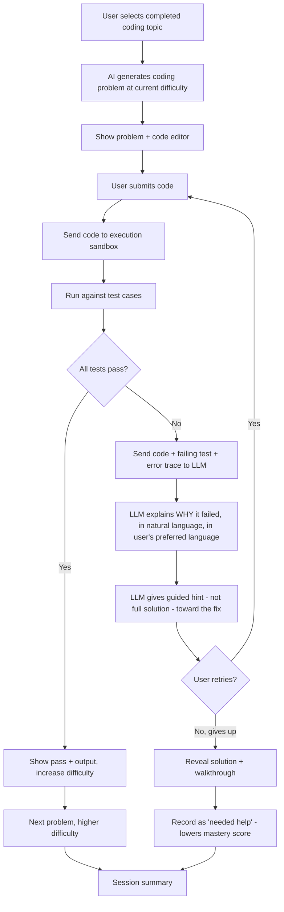

**Sandbox constraints:** containerized execution (e.g., Docker per submission), CPU/memory/time limits, no network access, language-specific runners (Python first for MVP).

---

### 7.5 Multilingual Voice Assistant

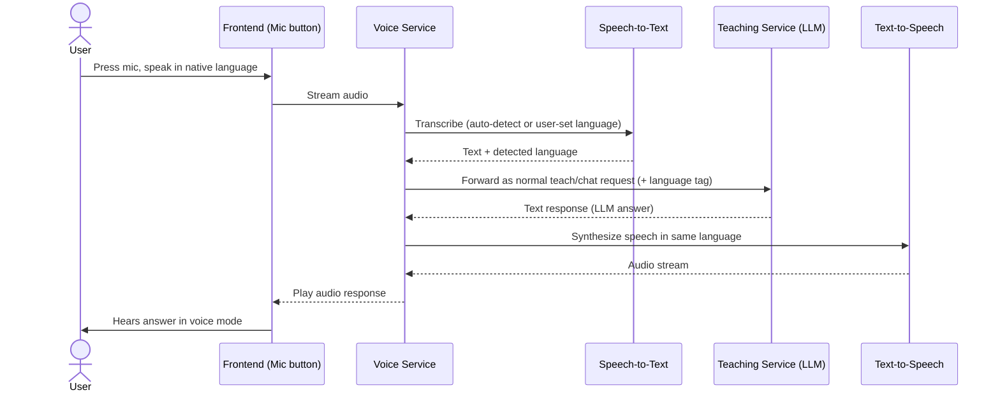

**Phase 1 scope decision needed:** which languages are actually supported (e.g., English + Hindi first; expand regional languages later) — STT/TTS quality varies a lot by language and this affects timeline.

---

### 7.6 Strength / Weakness Reporting

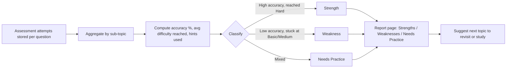

---

### 7.7 Authentication

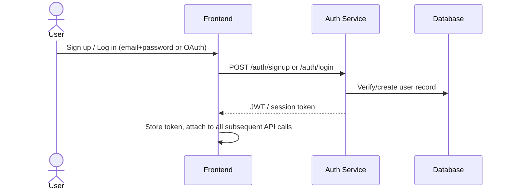

---

### 7.8 Pomodoro Focus Session

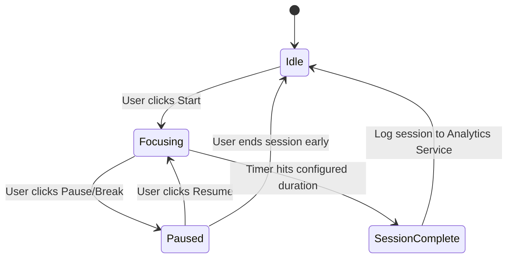

Each completed/paused session is logged with `subject_id`, `topic_id` (optional), duration, and timestamps — this data feeds Phase 2 activity visualizations.

---

## 8. Data Model (Entity Relationship Overview)

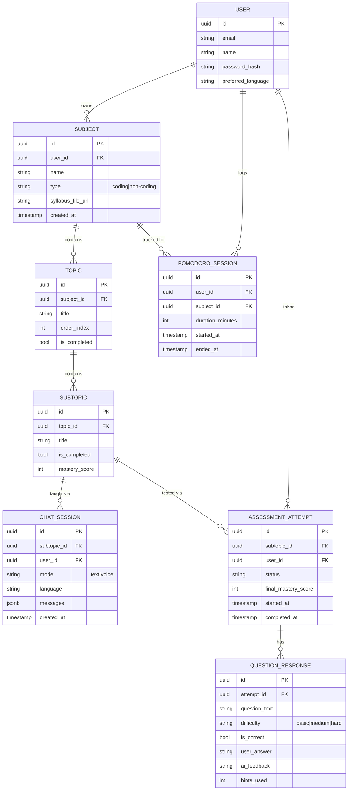

---

## 9. API Surface (Indicative)

| Method | Endpoint | Purpose |
|---|---|---|
| POST | `/auth/signup` / `/auth/login` | Authentication |
| POST | `/subjects` | Create subject (with/without syllabus) |
| POST | `/subjects/{id}/confirm` | Confirm AI-generated tree |
| GET | `/subjects/{id}/tree` | Get topic/sub-topic tree |
| PATCH | `/topics/{id}` | Mark complete/incomplete, edit |
| POST | `/teach` | Start/continue a teaching chat session |
| POST | `/voice/transcribe` | STT for mic input |
| POST | `/voice/speak` | TTS for response |
| POST | `/assessments/start` | Begin adaptive assessment on a sub-topic |
| POST | `/assessments/{id}/answer` | Submit answer (theory) |
| POST | `/assessments/{id}/submit-code` | Submit code (coding) |
| GET | `/assessments/{id}/summary` | Get results + mastery updates |
| GET | `/reports/{subject_id}` | Strength/weakness report |
| POST | `/pomodoro/start` / `/pomodoro/stop` | Focus session tracking |

---

## 10. Suggested Tech Stack (Phase 1)

| Layer | Suggestion | Why |
|---|---|---|
| Frontend | React | Fast iteration, good ecosystem for editors (Monaco) and audio |
| Backend | Node.js (expressJS) or python (fastAPI)  | FastAPI pairs naturally with AI/ML tooling if extraction/sandbox logic lives in Python |
| Database | PostgreSQL | Relational structure fits subject→topic→subtopic tree + assessment history well |
| Vector store | pgvector (inside Postgres) or a managed vector DB | Keep infra simple for MVP — pgvector avoids a second database |
| File storage | S3-compatible blob storage | Syllabus PDFs |
| LLM | Claude API | Teaching, syllabus parsing, question generation, error explanation |
| Code execution | Docker-based sandbox (e.g., Judge0 self-hosted or similar) | Isolation + language runners out of the box |
| STT/TTS | Cloud provider with strong regional language coverage (evaluate at build time) | Voice quality varies significantly by language — evaluate before committing |
| Auth | JWT + OAuth (Google) | Standard, low friction for students |

---

## 11. Non-Functional Requirements

- **Latency:** teaching chat responses should stream (token-by-token) to feel responsive, not block on full generation.
- **Cost control:** cache syllabus extraction results; don't regenerate question pools per attempt — generate once, reuse/adapt.
- **Sandbox security:** no network access from user-submitted code; strict timeouts (e.g., 5–10s) and memory caps.
- **Data privacy:** syllabus PDFs and chat transcripts are user-owned; deletion of a subject cascades to its chats/assessments.
- **Language fallback:** if STT/TTS fails for a requested language, fall back to text mode with a clear message rather than failing silently.

---

## 12. Open Questions (need decisions before/while building)

1. Which languages are in scope for voice in Phase 1 — English + Hindi only- yes 
2. Does mastery score persist and decay over time (spaced repetition style), or reset per assessment? -> decay
3. For coding assessment grading — pure test-case based, or does the LLM also review code style/approach? - both 
4. Should the AI-generated syllabus tree require explicit user confirmation before becoming "active," or auto-activate with an edit option? (This PRD currently assumes explicit confirmation.) -> yes
5. Max granularity of sub-topics — is there a cap to avoid infinite nesting from a messy syllabus?-> cap of 50 topics 

---

## 13. Phase 2 Preview

- Activity chart / heatmap of study sessions (from `POMODORO_SESSION` + `CHAT_SESSION` timestamps already being logged in Phase 1 — this is why they're in the data model now).
- Spaced-repetition style revision reminders based on mastery decay.
- Peer comparison / leaderboards (optional, needs privacy review).

---

